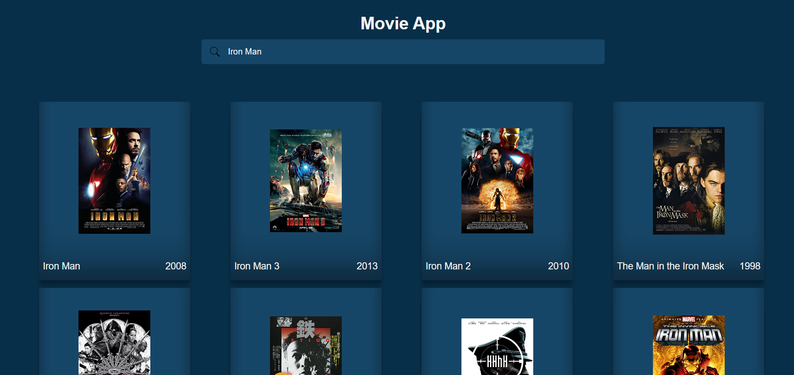

# Movie App
> _by Saloni_

This webpage titled Movie App is made using React. It is a simple movie generating app, where you enter movie name or keywords in the search bar and you'll get movie suggestions with the name. Also, if you click on any one of the suggested movie, you'll get details about that particular movie on the screen.

 * ## Tech Stack

    
    
    
    
    

 * ## Knowledge Gained

   1. Building react project.
   2. Having fun with coding.

 * ## Output:

   
   

 * ## Functionality Added:

   1. It has a simple and easy to use user interface.
   2. The user is able to search the movie by its name. For example: Iron Man
   3. The movie data is getting displayed after search in a proper way to the user.

 * ## Functionality Demonstration:

   